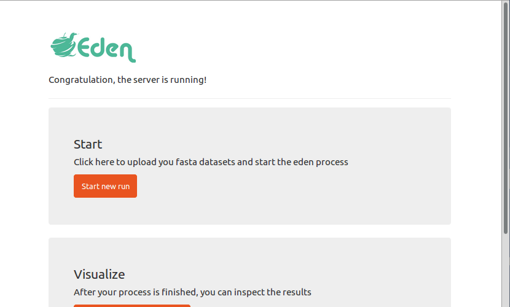
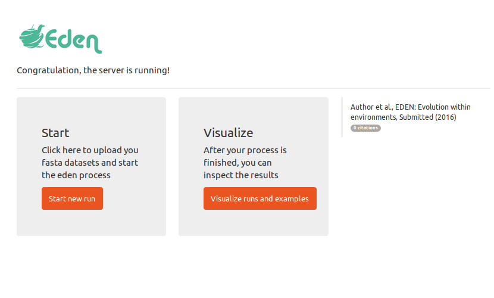

# eden

# install eden
dependencies: [Docker](https://github.com/docker/docker) 

the docker image is hostet via docker.io, you can pull/run it using these commands:

`sudo docker run -p 80:3838 edensoftware/eden` (version with example files)

`sudo docker run -p 80:3838 edensoftware/eden:minimal` (minimal version)

# install eden on windows

see the tutorial https://docs.docker.com/docker-for-windows/ for installation and setting up docker on your windows machine. 
Press WinKey + R, Input "cmd" and press enter to start the cmd.exe. Type in the following command to download/start the docker image

`sudo docker run -p 80:3838 edensoftware/eden` 


open your webbrowser and point it to [localhost](localhost)

# submit a new job


# visualize results


# build your own docker image

you can create the docker image from scratch:

```
git clone https://github.com/naturesubmission/eden.git
cd eden
sudo docker build eden_local .
sudo docker run -p 80:3838 eden_local
# point browser to localhost
```

