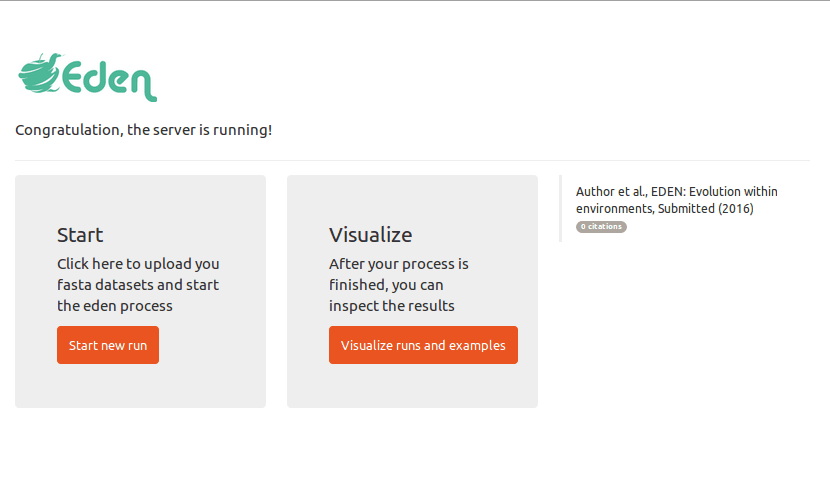

# eden

# install eden
dependencies: [Docker](https://github.com/docker/docker) 

`sudo docker run -p 80:3838 edensoftware/eden` (version with example files)
`sudo docker run -p 80:3838 edensoftware/eden:minimal` (minimal version)

open your webbrowser and point it to [localhost](localhost)

# submit a new job

# visualize results

